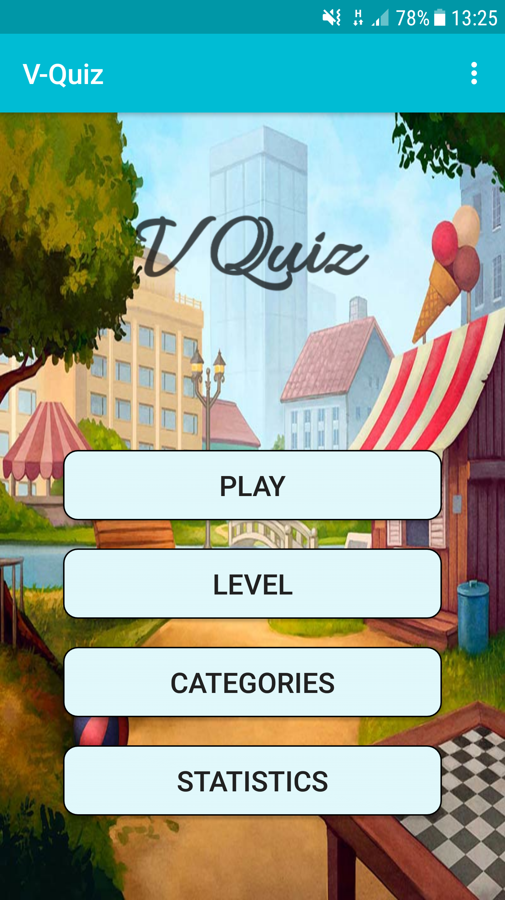
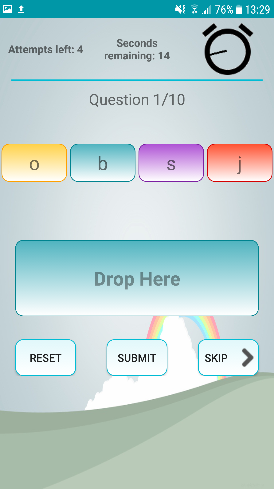

# Android-Vocabulary-Game

A mobile application created in android - java which helps students with vocabulary

### Prerequisites - installing

```
build project
make apk
run the project
```

End with an example of getting some data out of the system or using it for a little demo

## Versioning

We use git for versioning.

## Examples
  

## Authors

* ** Harrys Asimakopoulos ** - *Initial work* - (https://github.com/HarrysAsi/)

